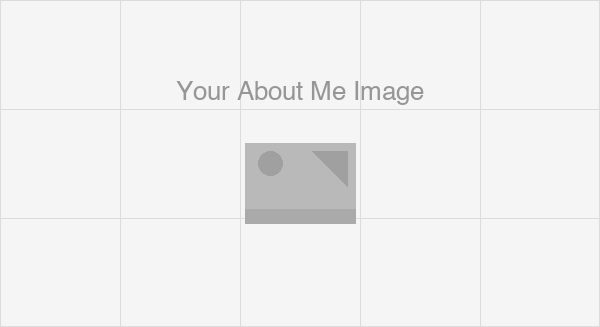

---
hide:
  - toc
  - navigation
---
<!--
CHECKLIST FOR THIS PAGE:
- [ ] Replace [YOUR NAME] with your full name (3 places)
- [ ] Replace [YOUR JOB TITLE] with your current or target role
- [ ] Replace [YOUR TAGLINE] with a short phrase describing your focus
- [ ] Rewrite the About Me paragraph with your own words
- [ ] Replace assets/images/profile.png with your actual photo (keep the filename or update it below)
- [ ] Replace assets/images/about.png with your own image (a field photo, map, or workspace shot)
- [ ] Edit the skill cards to match your actual skills (add, remove, or rename cards as needed)
- [ ] Update GitHub and LinkedIn links in the Connect section
- [ ] Add your CV PDF to docs/assets/ and update the filename in the Download CV button
-->

  
  <h1>Marc Gaeta</h1>
  
<strong>GIS Analyst / Planner</strong>

  
<em>Seeking new and exciting opportunities in spatial analysis and planning.</em>

---

## About Me

[Replace this paragraph with your own bio. Write 3–4 sentences covering: your background and
what you specialize in, the kinds of problems you work on, the tools and methods you use,
and what you are currently looking for. Example below:]

I am a geospatial analyst with a background in data analysis, cartography, and human geography.
I work on extracting actionable insights from satellite imagery and large spatial datasets
using Python, Google Earth Engine, and open-source GIS tools. I am passionate about applying
geospatial techniques to help solve real-world challenges across a multitude of fields. I am currently seeking opportunities in which I can leverage my exisintg skills, as well as develop new ones.

  

---

[View My Projects :material-arrow-right:](projects/index.md){ .md-button .md-button--primary }
[Download CV :material-download:](assets/Marc-CV.pdf){ .md-button }

---

## Skills

-   :material-database:{ .lg .middle } **Database Administration**

    ---

    - ArcGIS Online, ArcGIS Enterprise
    - Microsoft SQL Server, Microsoft Access
    - SQL, CSV, JSON, XML

-   :material-layers:{ .lg .middle } **Mapping & Cartography**

    ---

    - ArcGIS Pro, QGIS, Leaflet.js, Google My Maps, ArcGIS Urban
    - Heads-up Digitizing, Georeferencing, Field Mapping
    - Shapefile, File Geodatabase, KML, GeoTIFF

-   :material-star-four-points:{ .lg .middle } **Application & Web Development**

    ---

    - ArcGIS Experience Builder, ArcGIS Dashboard, ArcGIS Field Maps, ArcGIS Survey 123
    - GitHub, Visual Studio Code, MkDocs
    - HTML, CSS, JavaScript, Markdown

-   :material-code-braces:{ .lg .middle } **Analytics & Automation**

    ---

    - ArcGIS Spatial Analyst, Model Builder
    - Python, ArcGIS Notebook
    - Microsoft Power Automate

---

## Connect

[GitHub](https://github.com/marcgaeta/gis-portfolio.git){ .md-button }
[LinkedIn](https://linkedin.com/in/marcgaeta){ .md-button }
