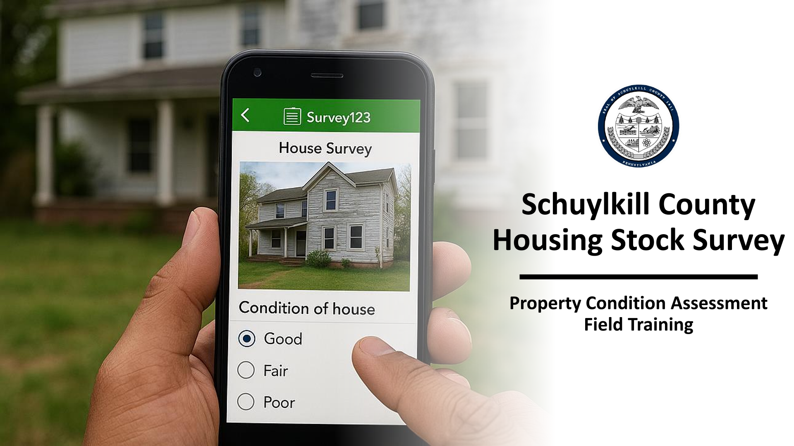

# Blight Housing Survey

## Overview

Developed and executed a mobile spatial data collection project to conduct a comprehensive Housing Stock Survey across Schuylkill County, Pennsylvania. The initiative established a standardized protocol for assessing residential structural conditions, vacancy statuses, and neighborhood blight metrics.

**Skill Highlight:** Data integrity best practices

**Study Area:** Schuylkill County  
**Role:** GIS Team Lead  
**Status:** Completed

---

## Methods & Tools

**Processing Steps**

1. Built and configured a custom field collection schema using ArcGIS Survey123, incorporating automated geolocation, dynamic parcel-layer integration, and drop-down domain rules to minimize field entry errors
2. Structured standardized rating criteria (Excellent, Good, Average, Fair, Poor) evaluating eight core structural elements: chimney, roof, gutters, exterior walls, windows/doors, porch, steps/handrails, and foundation
3. Implemented local offline caching via Outbox workflows for areas with limited cellular connectivity, along with photo attachment collection and reviewer verification for spatial data integrity
4. Onboarded, trained, and managed a team of interns on field data collection protocols, driving consistency in structural condition scoring and ensuring safety while using Survey123 in the field

**Tools Used**

| Tool | Purpose |
|------|---------|
| ArcGIS Pro | Custom basemap |
| ArcGIS Survey Connect | Survey field schema |
| Microsoft Powerpoint | GIS training documentation |
---

## Links

[Training Documentation](https://services.co.schuylkill.pa.us/portal/sharing/rest/content/items/3fa202a0d263466d8dc8a0adb5ee2af8/data){ .md-button }