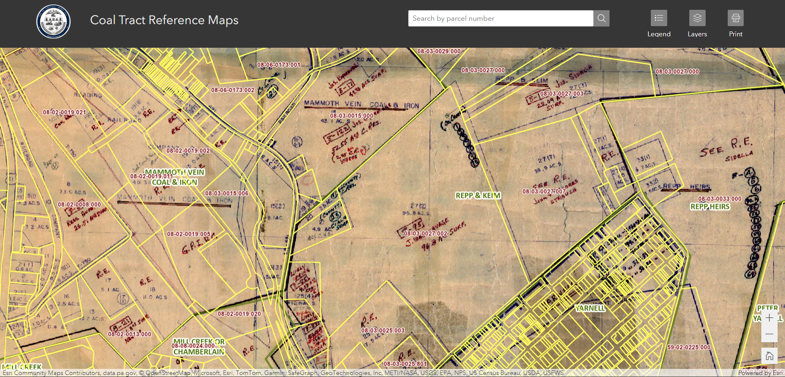
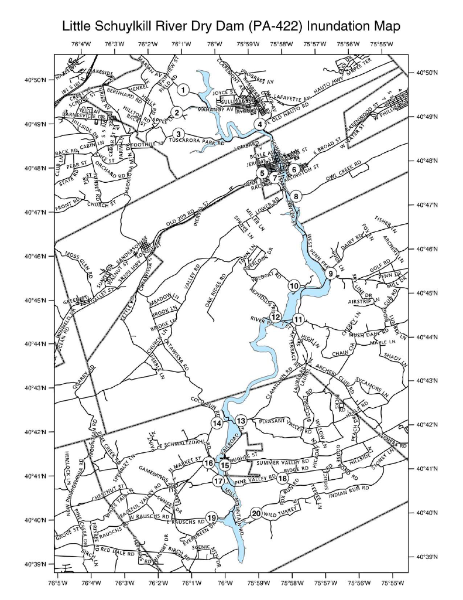

---
hide:
  - toc
  - navigation
---
<!--
CHECKLIST FOR THIS PAGE:
- [ ] Replace the two placeholder cards (marked [YOUR PROJECT ...]) with your real projects
- [ ] For each project: add a thumbnail image to docs/assets/images/ and update the path below
- [ ] For each project: create a project page by copying sample-project.md
- [ ] For each project: add a nav entry in mkdocs.yml (see the comments there)
- [ ] Delete placeholder cards you don't need yet
-->

# Projects

A selection of my geospatial projects. Click any card to see the full write-up.

**[Zoning Permit Tracker](zp-dashboard.md)**

[An ArcGIS Survey123 application for submitting Zoning Permit applications and maintaining records.]

`[Python]` `[Survey Connect]` `[ArcGIS Pro]`

[View Project →](zp-dashboard.md){ .md-button }

**[Coal Tract Lookup](coal-reference.md)**

[An ArcGIS Experience Builder parcel lookup application for digitally referencing historical paper coal maps.]

`[Experience Builder]` `[Georeferencing]` `[ArcGIS Portal]`

[View Project →](coal-reference.md){ .md-button }

**[Resource Hub Site](swt-hub.md)**

[A public facing website serving as a central hub for South Whitehall Township residents to access GIS-based applications and resources.]

`[ArcGIS Hub]` `[HTML]` `[CSS]`

[View Project →](swt-hub.md){ .md-button }

**[Site Suitability Analysis](site-analysis.md)**

[A weighted overlay analysis to determine site suitability and inform deciiosn-making for a community housing project in Schuylkill County, Pennsylvania.]

`[ArcGIS Storymaps]` `[Model Builder]` `[Spatial Analysis]`

[View Project →](site-analysis.md){ .md-button }

**[Flood Mapping](static-maps.md)**

[A technical map series detailing dam inundation areas and emergency points of interests in support of Schuylkill County's update to it's Emergency Action Plan.]

`[ArcGIS Pro]` `[Microsoft Word]` `[Adobe Acrobat]`

[View Project →](static-maps.md){ .md-button }

**[Housing Survey](housing-survey.md)**

[A team project to survey housing conditions in Schuylkill County, Pennsylvania.]

`[ArcGIS Pro]` `[ArcGIS Survey123]` `[Microsoft Powerpoint]`

[View Project →](housing-survey.md){ .md-button }

**[Walkability Analysis](ped-shed.md)**

[A spatial anlysis to determine the walkability scale of school zone areas in South Whitehall Township, Pennsylvania.]

`[Spatial Analysis]` `[ArcGIS Pro]` `[Digitization]`

[View Project →](ped-shed.md){ .md-button }

**[Park Asset Inventory](park-assets.md)**

[A project to GPS locate and inventory park assets in support of Schuylkill County's new Parks, Recreation, & Open Space Plan.]

`[ArcGIS Field Maps]` `[ArcGIS Dashboard]` `[ArcGIS Experience Builder]`

[View Project →](park-assets.md){ .md-button }

