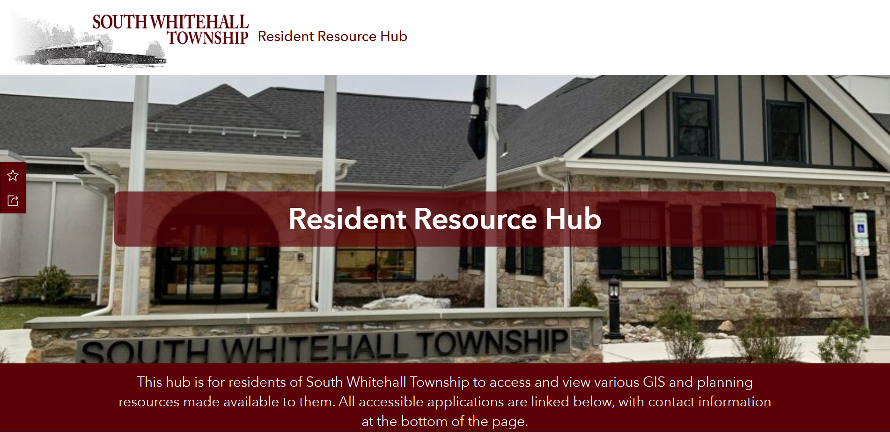

# Park Asset Inventory

## Overview

Created a website to serve as a GIS resource hub for a municipal government. Built out the site

**Study Area:** South Whitehall Township  
**Role:** Solo project  
**Status:** Completed

---

## Methods & Tools

**Data Sources**

- Legacy data
- 

**Processing Steps**

1. Deployed a website template
2. Used HTML and CSS to create a custom layout and styling 
3. Built out the website as a hosting site of maps, applications, and pages for subsequent projects
4. Maintained the content of the site and managed access

**Tools Used**

| Tool | Purpose |
|------|---------|
| ArcGIS Hub |  Website creation |
| HTML / CSS |  Website custumisation |
| ArcGIS Experience Builder |  Application development |
| Microsoft Power Automate |  Automated email app integration |
---

## Links

[View Dashboard](https://resident-resource-hub-swt-public-works.hub.arcgis.com/){ .md-button }