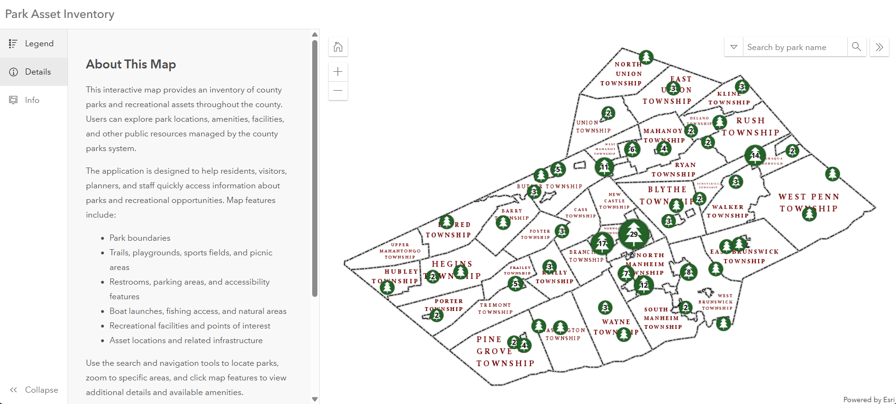

# Park Asset Inventory

## Overview

Developed a GIS database of municipal parks and their assets using ArcGIS Field Maps on iPads for in-field data collection. The project supported the development of a new County-wide Parks, Recreation, & Open Space Plan by providing accurate, location-verified asset data across the county's park system. The next phase of the project is designing a dashboard to convey the data in terms of park asset health and amenity coverage to help inform planning at the municipal level.

**Study Area:** Schuylkill County  
**Role:** Contributor  
**Status:** Ongoing

---

## Methods & Tools

**Processing Steps**

1. Sourced exisiting data from online sources and contacted municipal officials to identify all parks in the County and map their boundaries.
2. Created an ArcGIS Field Map for data collection.
3. Customised Field Map using Arcade scritping, default values, and domains to improve data collection efficency while maintaining database integrity.
4. Used Field Map to GPS-locate, assess the condition of, and photograph over 10,000 assets across 181 parks.

**Tools Used**

| Tool | Purpose |
|------|---------|
| ArcGIS Pro |  Database and basemap creation |
| ArcGIS Field Map |  Form creation and customisation for data collection |
| iPad |  GPS-locate and photograph park assets |
| ArcGIS Dashboard |  Data results presentation |
---

## Links

[View Application](https://services.co.schuylkill.pa.us/portal/apps/instant/sidebar/index.html?appid=f29c5be7ec594233895170764c8aa68c){ .md-button }