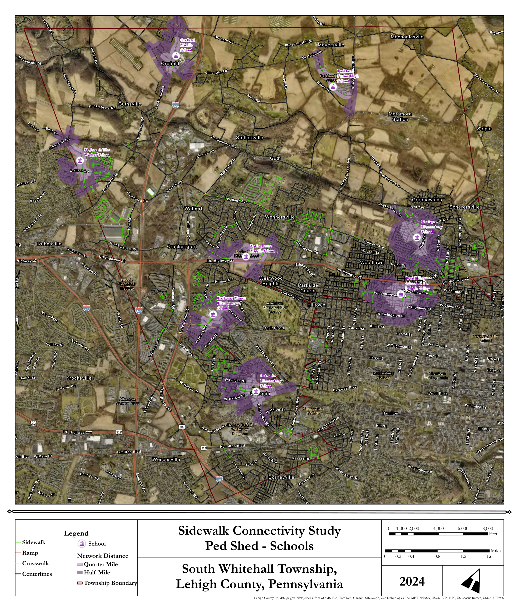

# Walkability Analysis

## Overview

Conducted a sidewalk connectivity study for South Whitehall Township, analyzing pedestrian access to schools through network-distance modeling. The analysis mapped quarter-mile and half-mile walking distances from each school along the existing sidewalk, crosswalk, and street centerline network, identifying gaps in sidewalk coverage and areas where students may lack safe walking access to school.

**Skill Highlight:** Network analysis

**Study Area:** South Whitehall Township  
**Role:** Solo project  
**Status:** Completed

---

## Methods & Tools

**Processing Steps**

1. Imported data from various sources for basemap creation
2. Created a grid map to track project progress 
3. Moving grid-by-grid, digitized sidewalks from aerial imagery
4. Performed a pedshed analysis for a half-mile and 1-mile radius from schools in the Township

**Tools Used**

| Tool | Purpose |
|------|---------|
| ArcGIS Pro |  Map and layout creation |
| Network Analyst |  Walkability analysis |

---