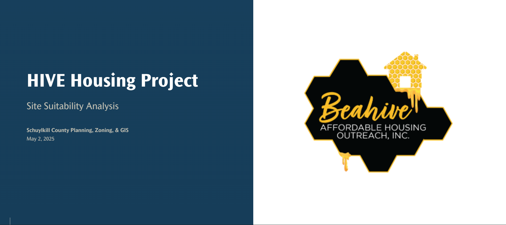

# Site Suitability Analysis

## Overview

Collaborated with a human services organization collective to idenitify potential sites for a low income halfway housing project. Criteria included proximity to schools and grocery stores, availability of water and sewer service, and access to public transportation. 

**Skill Highlight:** Working with different data types

**Study Area:** Schuylkill County  
**Role:** Solo project  
**Status:** Completed

---

## Methods & Tools

**Data Sources**

- KMZ data of STS bus routes
- Shapefiles of municipal sewer and water service
- FEMA flood mapping feature service rest point
- Tax sale CSV data

**Processing Steps**

1. Sourced data according to client's defined criteria and imported into ArcGIS Pro as map features
2. Buffered all features to a mile and a half-mile distances
3. Identified parcels included in tax claim sales in which 3 or 4 criteia overlapped
4. Created an ArcGIS Storymap detailing the processing steps of the project and its results

**Tools Used**

| Tool | Purpose |
|------|---------|
| ArcGIS Pro | Map creation |
| Model Builder | Spatial analysis |
| ArcGIS Storymaps | Presentation |
---

## Links

[View Storymap](https://services.co.schuylkill.pa.us/portal/apps/storymaps/stories/11f1f36834f94ec1a8f1463988e8a089){ .md-button }