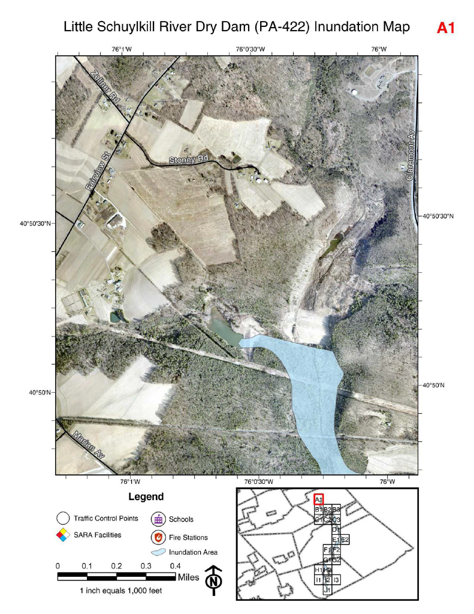
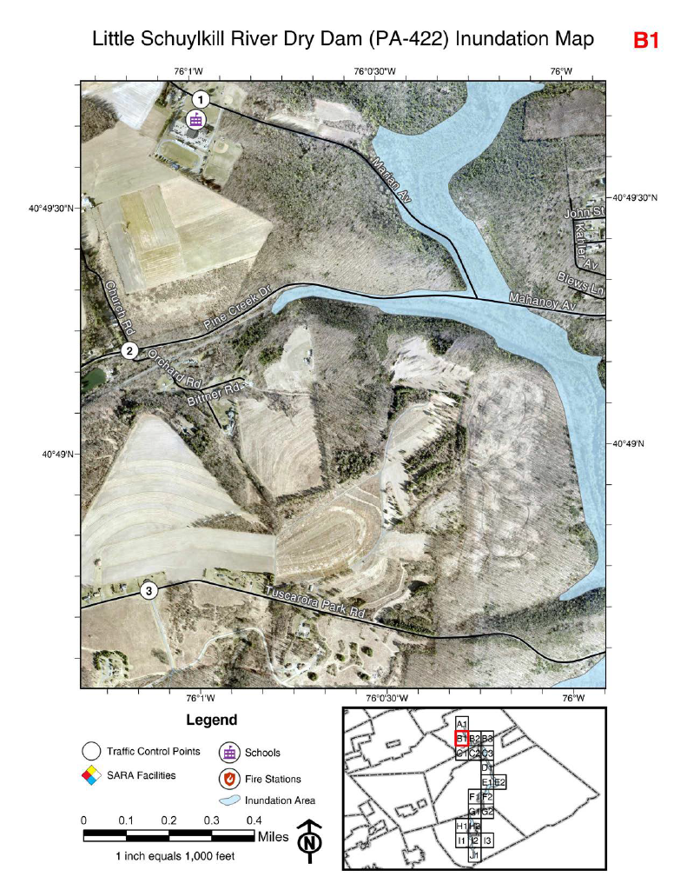

# Site Suitability Analysis

  

    

    

    

  

  <button class="pdf-slideshow-arrow pdf-slideshow-arrow--prev" aria-label="Previous slide">‹</button>
  <button class="pdf-slideshow-arrow pdf-slideshow-arrow--next" aria-label="Next slide">›</button>
  

## Overview

Created a simple application with an interactive map to quickly lookup parcels and reference GIS data against historical paper maps of coal tracts. Eliminates the manual search and review process comparing a digitial map against local image files, significantly reducing the time needed to confirm tract ownership.

**Study Area:** Schuylkill County  
**Role:** Solo project  
**Status:** Completed

---

## Methods & Tools

**Data Sources**

- Scanned images of historical coal tract paper maps
- Existing County parcel data

**Processing Steps**

1. Created a basemap of parcel, municipal boundary, and coal tract data
2. Imported scanned images to project and manually georeferenced them to align to the basemap parcels
3. Built a user application with a simple interface for searching by parcel location and toggling georeferenced images 
4. Created ArcGIS Online account for a non-technical user and provided training on application access and use

**Tools Used**

| Tool | Purpose |
|------|---------|
| ArcGIS Pro |  Basemap creation and georeferencing |
| ArcGIS Experience Builder | Built simple application interface for non-technical users |

---

## Links

[View Dashboard](https://services.co.schuylkill.pa.us/portal/apps/storymaps/stories/11f1f36834f94ec1a8f1463988e8a089){ .md-button }