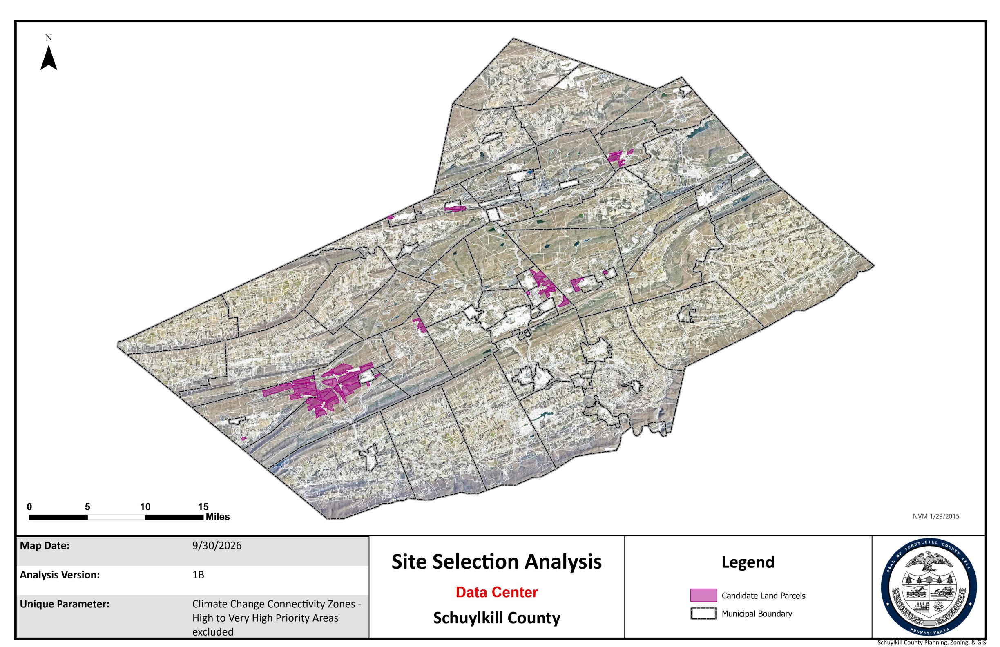

# Viewshed Analysis

## Overview

Conducted a land suitability analysis to identify candidate parcels for development by screening parcels against zoning, access to public water service, slope, and a set of environmental and land-use exclusion criteria (streams, wetlands, flood hazard areas, protected lands, parks, agricultural security areas, and game lands). Candidate sites were required to contain at least 20 contiguous buildable acres on slopes of 15% or less, and were cross-referenced against regional Climate Change Connectivity priority zones to flag parcels with potential conservation value. Created an ArcGIS Notebook of the analysis workflow for easy replication and iteration. The next phase of the project will be to assess the impact to scenic landscapes at select proposed building sites.

**Skill Highlight:** Python scripting

**Study Area:** Schuylkill County  
**Role:** Solo project  
**Status:** In development

---

## Methods & Tools

**Processing Steps**

1. Acquired bare-Earth Digital Elevantion Model raster and projected it in the necessary coordinate system to calculate slope
2. Drafted a workflow of the analysis steps
3. Conducted the analysis (view full workflow below)
4. Reproduced analysis workflow with python script and instructive markdown in ArcGIS Pro

**Tools Used**

| Tool | Purpose |
|------|---------|
| ArcGIS Pro |  Basemap creation |
| Spatial Analyst |  Geoprocessing |
| ArcGIS Notebook |  Script development |

---

## Links

[Download Analysis Workflow :material-download:](../assets/viewshed-analysis.pdf){ .md-button }