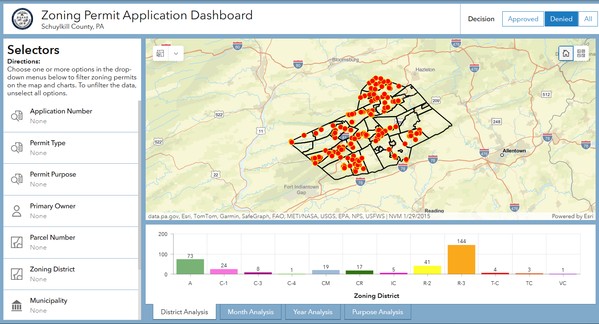

# Zoning Permit Tracking

## Overview

Created a dashboard with the dual purpose of allowing users to track the status of pending permit applications as well as compiling a historical record of all applications to analyze trends. Included is a backend functionality to export custom report documents.

**Skill Highlight:** Data handling / cleaning

**Study Area:** Schuylkill County  
**Role:** Solo project  
**Status:** Completed

---

## Methods & Tools

**Processing Steps**

1. Created the database structure and survey elements in ArcGIS Survey Connect
2. Extracted, cleaned, and prepared data from the exisitng data Excel table data using ArcGIS Pro and Python to append to new database structure 
3. Built the user application, connecting the data sources, styling elements, and configuring analytical charts using ArcGIS Dashboard
4. Formatted the template for exporting custom reports using Microsoft Windows and ArcGIS Survey 123

**Tools Used**

| Tool | Purpose |
|------|---------|
| ArcGIS Pro |  Prepared data and created survey basemap |
| ArcGIS Survey Connect | Created the application intake survey |
| ArcGIS Dashboard | Built the permit tracking dashboard |

---

## Links

[View Dashboard](https://services.co.schuylkill.pa.us/portal/apps/dashboards/d28c8c4107f4479e867dc251663101b3){ .md-button }